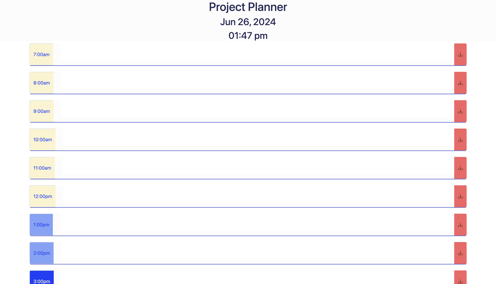

# Work Day Planner

# Table of Contents

1. [Introduction](#introduction)

2. [Key Features](#key-Features)

3. [Installation](#Installation)

4. [Usage](#Usage)

5. [Technologies Used](#Technologies-Used)

6. [ChangeLog](#ChangeLog)

7. [Screenshots](#Screenshots)

8. [Demo](#Demo)

9. [Acknowledgements](#Acknowledgements)

10. [License](#License)

11. [Contact](#Contact)

# Introduction 

This website showcases the integration of third-party APIs to provide a platform for scheduling a typical workday.

- Users can easily structure their day, increase productivity, complete their goals, and achieve a sense of accomplishment.

- This website is designed for individuals who lack a daily schedule, those who enjoy planning their workday for optimal efficiency, and anyone who values organization.

# Key Features

- Current Date and Time Display: Upon opening the website, users can see the current date and time at the top of their screen.

- Time Blocks for Standard Business Hours: The website displays time blocks representing standard business hours.

- Color-Coded Time Blocks: Each time block is color-coded to indicate its status:
    * Past: Off-white
    * Present: Light blue
    * Future: Dark blue

- Task Input: Users can select or click on a time block to input a task or event.

- Task Saving: By clicking the submit button on the right of the time block, the event is saved to local storage.

- Persistent Data: When the page is refreshed, text saved to its corresponding time block remains intact.

# Installation
In order to access the website:

1. Access the live website link below

2. Alternatively, follow these steps to run the application locally:
    * Ensure you have a terminal open, a GitHub account, and VS Code installed on your machine.
    * Access the repository of this Work Day Planner on Github.
    * Click the green "Code" button and copy the SSH url.
    * Ensure you have an SSh key set up in your terminal.
    * Clone the repository by enterning: 'Git Clone [SSH Url]'.
    * Navigate to the project in your terminal.
    * Enter the command 'Code .'.
    * VS Code should open with the project.
    * Drag the 'index.html' file to an empty browser tag.

# Usage
In order to use this application: 

- Open the website and select the first time slot that is most appropriate to start.

- Once that time slot has been selected, input a task or event that should be completed.

- Once that task or event has been input in the correct time slot, click the submit button loacted on the right of the time slot.

- Refresh the browser and notice that the task has pesisted.

- Continue to input more tasks if needed as well.

# Technologies Used

- JQuery Elements

- Day.js

- Local Storage

# ChangeLog

- Further changes to be implamented in the future in order optimize this website include. . .

    * Adjusting the present time slot coloring so that only one slot is shaded light blue to indicate the current hour.

    * A Check box in order to indicate that a task has been completed.

    * Saving the associated time when a task is added to local storage.

    * Adding a delete button to remove a saved task or a clear button to clear all tasks for scheduling another day.

# ScreenShot

# Demo

- Will Add after next commit

# Acknowledgements

A special thanks to Columbia University Bootcamps for providing the educational material as well as the inspiration and criteria for this project!

# License
This project is released under the MIT License. For more details, please refer to the [MIT License](./LICENSE)

# Contact

If you have any questions, suggestions, or feedback, you can reach out to the project maintainer at [taylor.brandon22545@gmail.com](mailto:taylor.brandon22545@gmail.com) or create an issue on the GitHub repository.

